Noob Friendly, Setting up Jenkins on Kubernetes and running the first job.

```
Hello World !
```

This is what we are going to see in the end of this noob friendly tutorial. I won't be using GUI in this tutorial to a large extent. CLI is the right way to learn doing things, so we will be holding on to our PS (PowerShell) Terminals for more than 80% of the tut.

Pre-requisites: Here are the pre-requisites to follow along:
- The OS of Choice is Windows 10. However this can be translated to any Linux or MacOS enviornments with slight tweaks. The overall flow would still remain the same.
- Azure Free Account Created: Create your Azure free account today | Microsoft Azure

Topics: In this tutorial I will be covering the following topics:

- Installing Azure CLI - Command line for Azure Services
- Deploying Azure Kubernetes Service (AKS) cluster
- Installing Kubectl - Command line for Kubernetes
- Deploying Jenkins on the AKS
- Setup Jenkins & Create your first pipeline


## Installing Azure CLI

Azure Portal is a very user friendly GUI for getting almost anything done in Azure. With an impressive Shell right in the portal it comes with all the goodies. But to know the activities better, to make it more cleaner and maybe even automate, I decided to go with Az or the Azure CLI.

Fire up your PS terminal as an Administrator and enter the below to download and install latest Azure CLI.

```
Invoke-WebRequest -Uri https://aka.ms/installazurecliwindows -OutFile .\AzureCLI.msi; Start-Process msiexec.exe -Wait -ArgumentList '/I AzureCLI.msi /quiet'; rm .\AzureCLI.msi
```

After installation, close and reopen the PS Terminal. To confirm the installation was successful enter the below:

```
az --version
```

If all went well you should see screen as shown below:

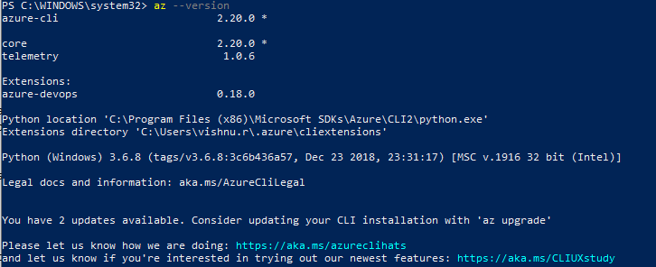

## Deploying Azure Kubernetes Service (AKS) cluster

Those of who are interested in knowing more about K8s (short for Kubernetes) should definitely try to go through their Documentation. Its an excellent coffee time read !([Kubernetes Documentation | Kubernetes](https://kubernetes.io/docs/home/))

Ok, so lets get started by logging into Azure via CLI. In the PS Terminal run the below line. This would open your default browser and take you to Azure Login page. Use your login name and password used during the creation of account to validate.

```
az login
```

**Note**: The browser should automatically redirect to Azure CLI documentation page after a successful login. You can go ahead and read it if you would like to learn more, else close the window.

On successful login you should see the below in your terminal:

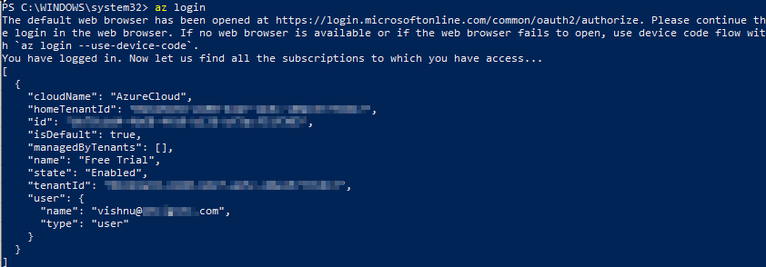

First thing to do after logging in would be to create a new Resource Group for the activities to follow. Execute below line to create a Resource group named 'Jenkins'. This would be setup in location *southindia*.

```
az group create --name Jenkins --location southindia
```

**Tip**: If you would like to know all different locations, run:

```
az account list-locations
```

Alright, we have now geared up to perform what we started this mission for. As a last check, run the below to ensure that we have the required subscriptions to perform the activities:

```
az provider show -n Microsoft.OperationsManagement -o table
az provider show -n Microsoft.OperationalInsights -o table
```

Once these pass clear then we are good to go. If this threw some error then we need to run below:

```
az provider register --namespace Microsoft.OperationsManagement
az provider register --namespace Microsoft.OperationalInsights
```

With our brand new Resource group in hand, lets create an AKS in it. As you see below I am creating a cluster named myk8Cluster. We will start with just one node and use the standard resource.

```
az aks create --resource-group Jenkins --name myk8Cluster --node-count 1 --enable-addons monitoring --generate-ssh-keys
```

This process should take some time to complete. In the mean time lets prepare our PC to start using *kubectl*.

## Installing Kubectl - Kubernetes CLI

Kubectl is very powerful and helpful for us to get total control over the K8s. It accepts yaml configurations, which will help us with remaining process.

```
az aks install-cli
```

Once this completes, lets get the credentials to access the AKS from Azure. This will store the required credentials in the local PC.

```
az aks get-credentials --resource-group Jenkins --name myk8Cluster
```

**Note**: During the Kubectl installations there would be several warnings asking you to add the PATH to the Windows Environment Variables. Add these to call the kubectl command from the terminals.

After the kubectl is installed, you need to restart the PS Terminal. Test the kubectl by running the below, it should show you the active K8s/AKS nodes

```
kubectl get nodes
```

This should give an output like below:

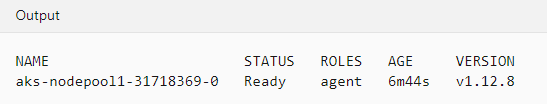


## Deploying Jenkins on AKS

Lets create a namespace for deploying the Jenkins in AKS. This helps us in simplifying the configurations.

```
kubectl create namespace jenkins
```

To deploy the Jenkins app to the Pod we need to run the below line. Please note that the configuration required has been passed here as a yaml file.

```
kubectl create -f 'C:\Scripts\jenkins.yaml' --namespace jenkins
```

jenkins.yaml looks like this:

```
apiVersion: apps/v1
kind: Deployment
metadata:
  name: jenkins
spec:
  replicas: 1
  selector:
    matchLabels:
      app: jenkins
  template:
    metadata:
      labels:
        app: jenkins
    spec:
      containers:
      - name: jenkins
        image: jenkins/jenkins:lts
        ports:
          - name: http-port
            containerPort: 8080
          - name: jnlp-port
            containerPort: 50000
        volumeMounts:
          - name: jenkins-vol
            mountPath: /var/jenkins_vol
      volumes:
        - name: jenkins-vol
          emptyDir: {}
```

Here we define the app name jenkins, the container image (& version) that requires to be used. We also define the ports which will be used.

After the above step has been completed, run the below line to see the pods that has been spun up and running.

```
kubectl get pods -n jenkins
```

You will see information like below, please note the suffix after jenkins will be different for you.

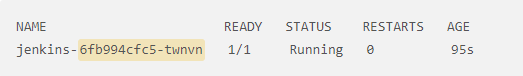

Once we confirm the running status, lets expose the jenkins pod using a service, here I am using a LoadBalancer service to expose the app to the outside world. Once again we are taking advantage of the yaml config file to pass the requirements.

```
kubectl create -f 'C:\Scripts\jenkins-service.yaml' --namespace jenkins
```

jenkins-service.yaml looks like this:

```
apiVersion: v1
kind: Service
metadata:
  name: jenkins
spec:
  type: LoadBalancer
  ports:
    - port: 8080
      targetPort: 8080
      nodePort: 30000
  selector:
    app: jenkins


---


apiVersion: v1
kind: Service
metadata:
  name: jenkins-jnlp
spec:
  type: ClusterIP
  ports:
    - port: 50000
      targetPort: 50000
  selector:
    app: jenkins
```

Perfect, by now we have done major part of the tasks that needs to be done. We can watch the status of external ip creation by running the below line:

```
kubectl get services --namespace jenkins --watch
```

The output should look similar to below. Please make note of the external ip from your terminal because thats what we will be using in the next parts.

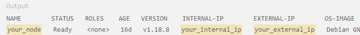

Reuse the code we used above 'kubectl get pods -n jenkins' to get the suffix of our pod. we will need to use this in to run the below line.

```
kubectl logs jenkins-6fb994cfc5-twnvn -n jenkins
```

This will give a log output on the terminal. From this, you will have to copy the password for the admin which was auto generated during the installation. You will see your password in place of 'your_jenkins_password'

```
Running from: /usr/share/jenkins/jenkins.war
webroot: EnvVars.masterEnvVars.get("JENKINS_HOME")
. . .

Jenkins initial setup is required. An admin user has been created and a password generated.
Please use the following password to proceed to installation:

your_jenkins_password

This may also be found at: /var/jenkins_home/secrets/initialAdminPassword
...
```

Thats it! Now we have Setup K8s and have a running Jenkins App. Sadly thats the end of all operations using CLI for this tutorial. Now we will head to the GUI of Jenkins and set it up.

## Setting up Jenkins & Creating First pipeline

Let's head straight to the URL to access our Jenkins app in the AKS. We will use the external IP obtained before. In the below example, am assuming the external IP is 12.12.12.12

```
 http://12.12.12.12:8080/
```
You will see a page asking for the admin password. Remember the password we obtained earlier from the log. Yes, we will be using it here and then click continue.

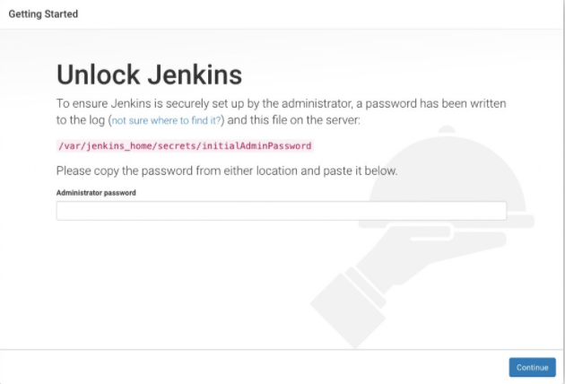

In this next page select the Install suggested plugins and proceed. This process will take some time to complete. Time for a short break!

Alright, once the installation is completed it would take us to a page were we will be asked to enter the username and new password. Lets skip all that for the time being. I am going to continue to use the admin as username and the password from logs for some more time. You can set these any time later from within the application if required.

From the Landing page click on the New Item 

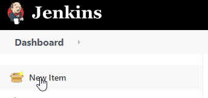

From the new items page, do the following:

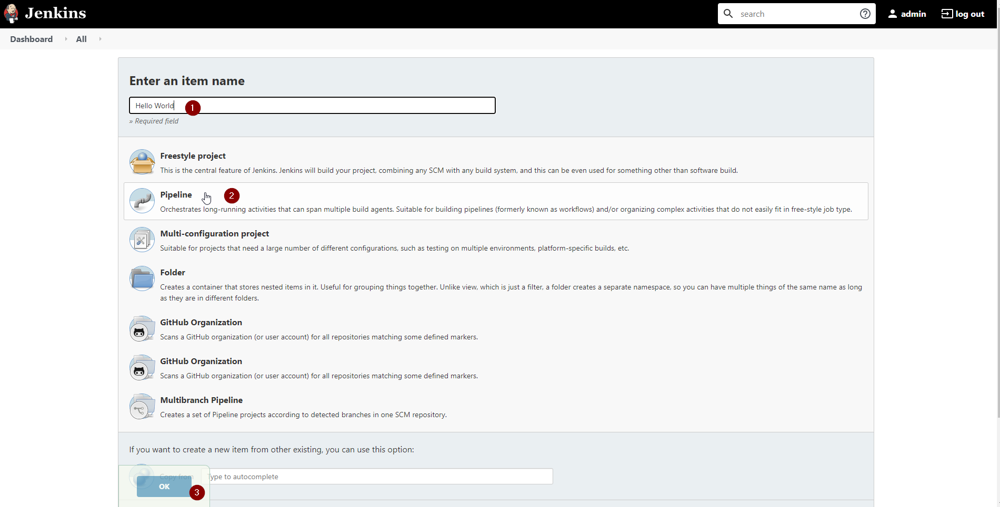

1. Enter the Name of the pipeline. e.g Hello World
2. Select the Method as Pipeline
3. Click Ok to continue

In the next page scroll down to the bottom to see the pipeline scripting section. Paste the hello world script as below

```
pipeline {
    agent any 
    stages {
        stage('Stage 1') {
            steps {
                echo 'Hello world!' 
            }
        }
    }
}
```

It should look like this, click save and apply.

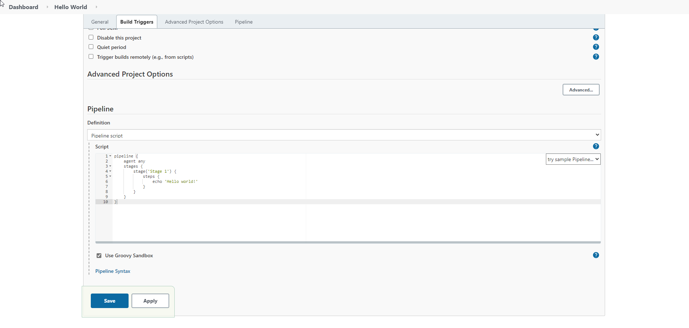

Now click on the pipeline name we just created (use the top breadcrumbs)

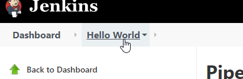

Click on the Build Now from the left menu.

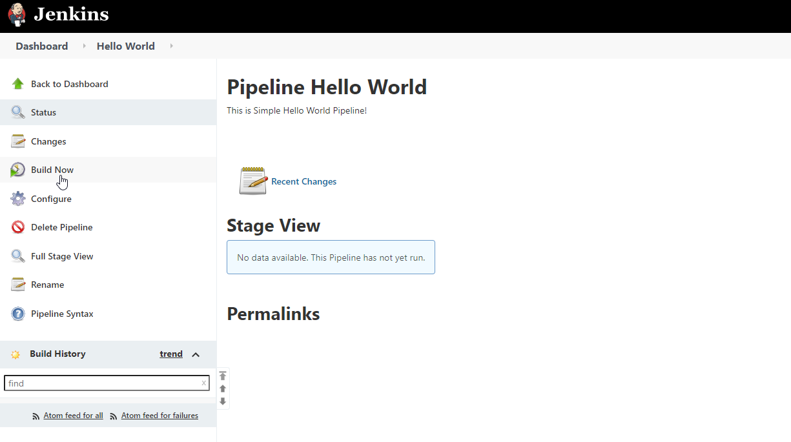

you will notice a pipeline run in progress as shown below:

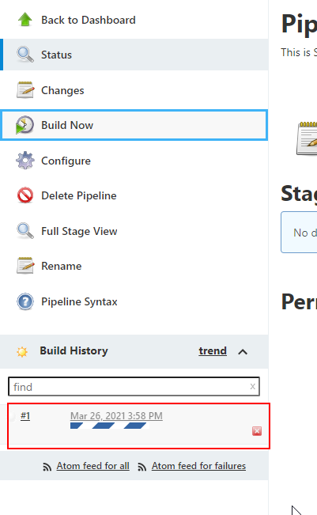

Thats it ! We have created & run a simple pipeline in Jenkins.

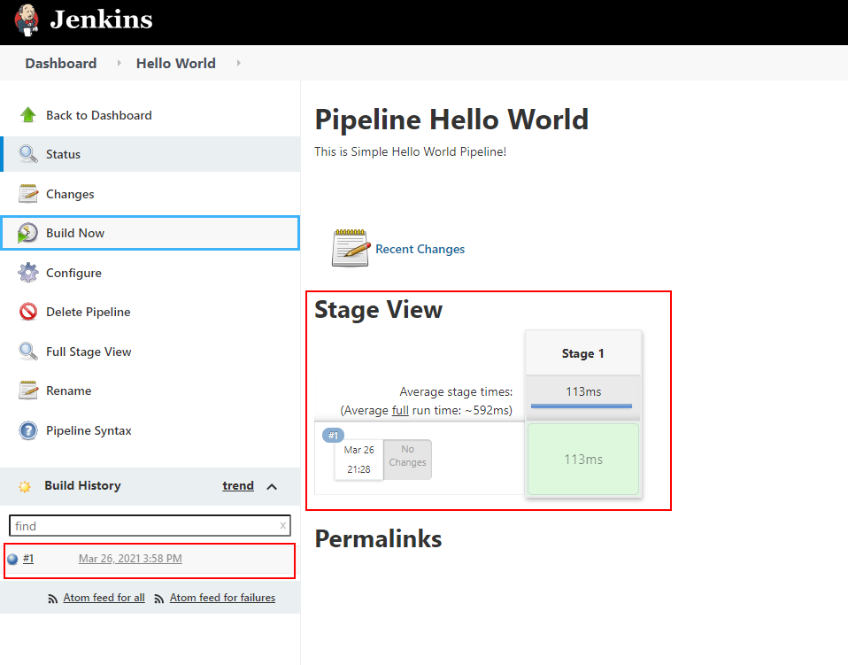

Click on the #1 to check the build output or simply click on the stage logs to see the output.

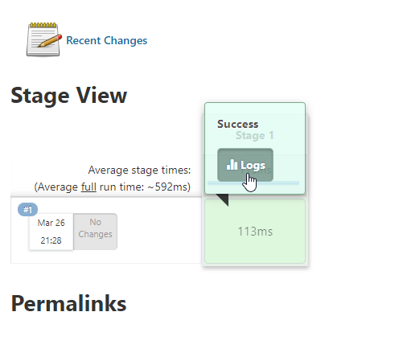

You will see the Hello World Output as Expected!

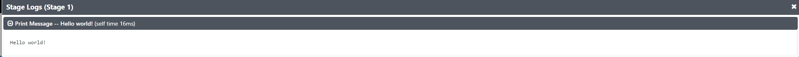

Thank you all for staying with me throughout the tut. Hope you all enjoyed it.

*Keep Automating! Keep Learning! For Sky is the Limit!*


## Credits & Sources

[Getting started with Pipeline (jenkins.io)](https://www.jenkins.io/doc/book/pipeline/getting-started/)

[Quickstart: Deploy an AKS cluster by using Azure CLI - Azure Kubernetes Service | Microsoft Docs](https://docs.microsoft.com/en-us/azure/aks/kubernetes-walkthrough)

[How To Install Jenkins on Kubernetes | DigitalOcean](https://www.digitalocean.com/community/tutorials/how-to-install-jenkins-on-kubernetes)